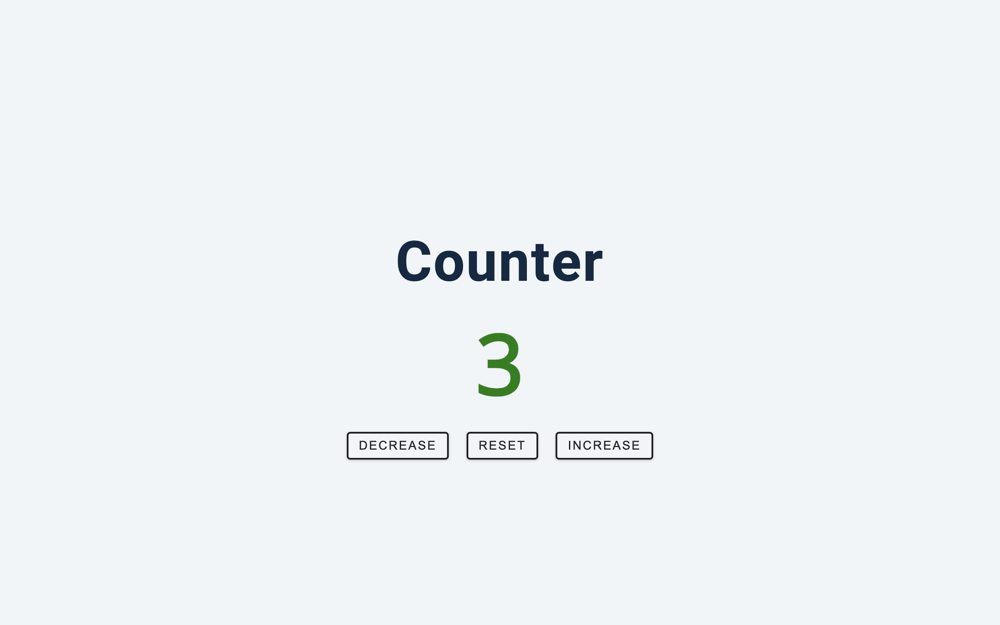

##   Vanilla.js Counter

This project is a simple counter application built using HTML, CSS, and **vanilla JavaScript**. Its primary purpose is to **practice and solidify vanilla JavaScript skills**, particularly focusing on:

-   **DOM manipulation**
-   **Event handling**
-   **State management**

This application serves as a learning exercise and a stepping stone for further exploration and development using vanilla JavaScript.

### Why Vanilla JavaScript?

While frameworks like React offer efficient ways to build user interfaces, this project deliberately utilizes vanilla JavaScript to:

-   **Deepen understanding:**  By working with the underlying code, gain a  **deeper understanding of core functionalities**  involved in building a counter application.
-   **Master fundamentals:**  Focus on essential concepts like DOM manipulation, event handling, and state management  **without relying on framework abstractions**.
-   **Simplify complex concepts:**  Working with lower-level code provides a  **clearer understanding**  of how these complex concepts work, making them easier to grasp and apply in future projects.

### Learning Outcomes

Building this application with vanilla JavaScript resulted in several benefits:

-   **Stronger fundamentals:**  Solidified understanding and practical implementation of  **crucial vanilla JavaScript concepts**.
-   **Enhanced problem-solving:**  Honed  **problem-solving skills**  by focusing on core functionalities.
-   **Appreciation for frameworks:**  Gained a deeper  **appreciation for the efficiency and abstraction**  provided by frameworks like React.

This experience not only reinforced vanilla JavaScript skills but also highlighted its importance in solidifying the **fundamentals essential for building applications with any framework**.

### How to Use

1.  Clone or download the repository.
2.  Open the  `index.html`  file in your web browser.
3.  Interact with the buttons to increment and decrement the counter.

### Technologies Used

-   HTML: Provides the basic structure of the web page.
-   CSS: Styles the layout and appearance of the page.
-   JavaScript: Adds interactivity and manipulates the DOM to manage the counter functionality.
